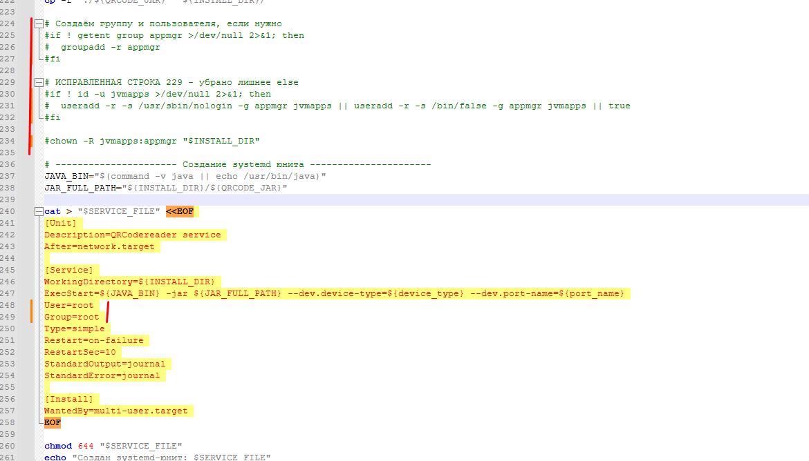

# Инструкция по настройке сканера на RedOS

При возникновении сообщения **«Сканер не подключен»** во время работы в **«Веб-аптеке»**, выполните шаги по данной инструкции.

> **Внимание!** Данная инструкция подходит, если сервис *qrcodereader* уже установлен в системе.

---

## Открытие файла настроек службы

1. Запустить терминал любым удобным способом.
2. Выполнить команду для открытия файла:
   ```bash
   sudo nano /etc/systemd/system/qrcodereader.service

## Изменение пользователя и группы

1. В открывшемся файле найти следующие строки:

   ```bash
   User=jvmapps
   Group=appmgr
 
2. Заменить их на:

   ```bash
   User=root
   Group=root

Пример строк после замены на [рисунке 1](#fig1).

<a name="fig1"></a>
<p align="center">
  
</p>
<p align="center"><em>Рисунок 1 – Изменение пользователя и группы</em></p>

## Сохранение изменений 
1.	Нажать Ctrl + X.
2.	Нажать Y, чтобы подтвердить сохранение. 
3.	Нажать Enter, чтобы подтвердить имя файла.

## Перезапуск службы
Выполнить по очереди следующие команды для перезапуска службы:
 ```bash
   sudo systemctl daemon-reload
   sudo systemctl restart qrcodereader
```