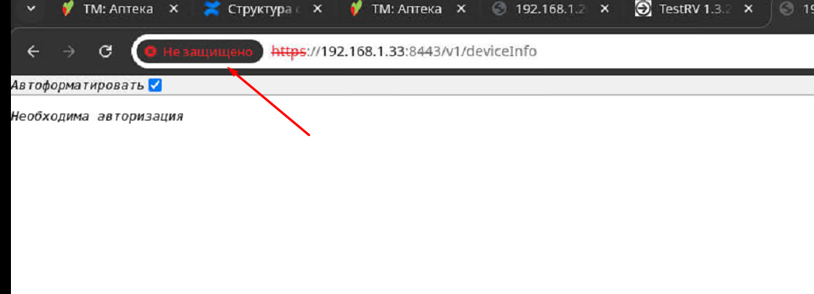
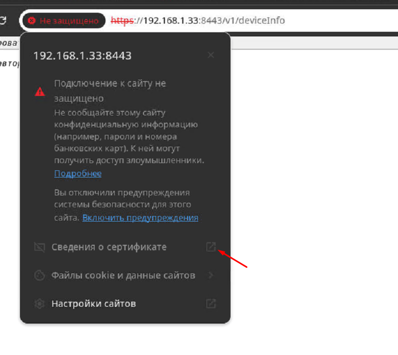
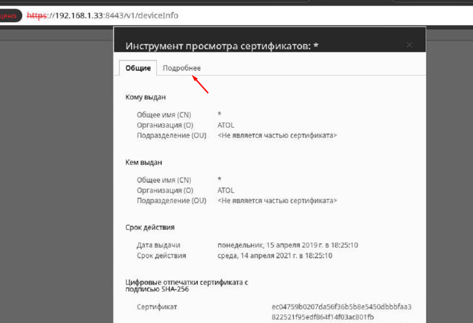
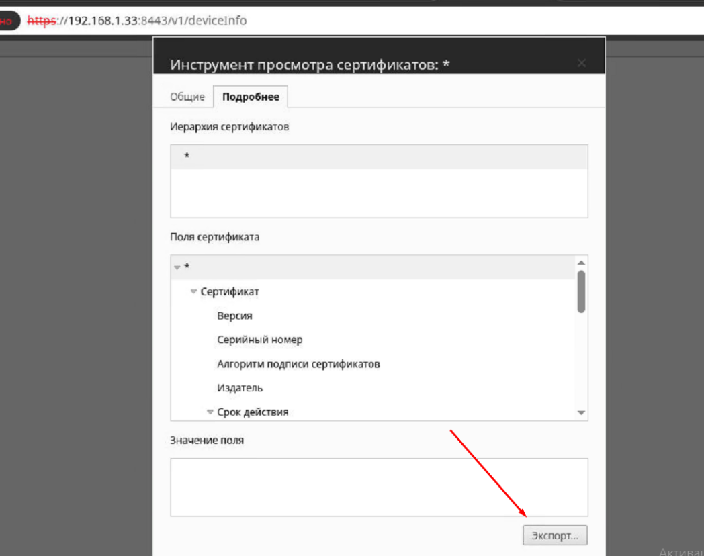
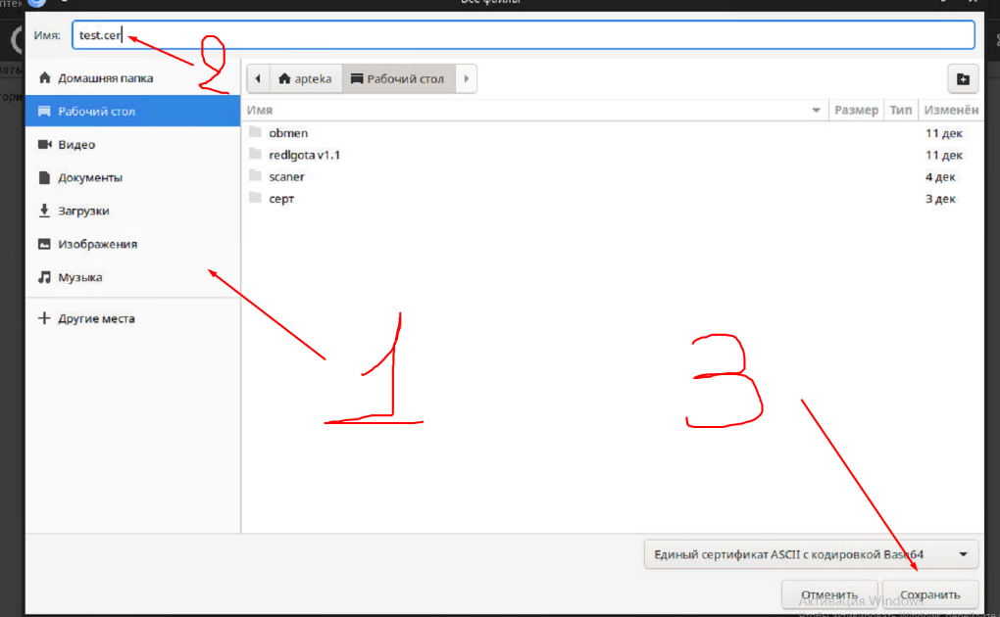

# Инструкция по развертыванию сервиса на Linux


## Получение исполняемого файла jar

-   Взять исполняемый JAR-файл из директории сборки требуемой версии.
-   Скопировать скрипт установки службы, приведённый ниже, в файл с
    именем `make_service.sh`.

## Предварительные требования

Перед установкой необходимо убедиться, что на сервере установлена **Java
Development Kit (JDK) версии 17**:

``` bash
java -version
```

Если версия не совпадает с необходимой, необходимо установить JDK 17
(CentOS/RHEL):

``` bash
yum install -y java-17-openjdk java-17-openjdk-devel
```

------------------------------------------------------------------------

## Установка сервиса

1. Создать директорию для сервиса:

``` bash
mkdir -p /opt/mdlp-proxy
```

2. Скопировать в созданную директорию следующие файлы:

-   `mdlp-proxy.jar`
-   `application.yml`
-   `truststore.jks` (если используется локальный)

3. Для упрощенной установки systemd-сервиса запустить скрипт:

``` bash
./make_service.sh mdlp-proxy
```

------------------------------------------------------------------------
Скрипт *make_service.sh* выполняет следующие функции

-   создание пользователя `tomcat`
-   создание каталогов `/opt/mdlp-proxy` и `/opt/mdlp-proxy/logs`
-   генерация systemd unit: `/etc/systemd/system/mdlp-proxy.service`
-   создание стартового файла: `/opt/mdlp-proxy/mdlp-proxy.sh`
-   назначение прав и автозапуска

------------------------------------------------------------------------

Содержимое скрипта

``` bash
#!/bin/sh

groupadd tomcat
useradd -s /bin/false -g tomcat -d /opt/tomcat tomcat

SERVICE_FILE="/etc/systemd/system/$1.service"
SH_FILE="/opt/$1/$1.sh"
JAVA_PATH=$(readlink -f $(which java))

mkdir -p /opt/$1/logs

/bin/cat <<EOM >$SERVICE_FILE
[Unit]
Description=$1
After=syslog.target

[Service]
User=tomcat
Group=tomcat
Type=simple
WorkingDirectory=/opt/$1/
ExecStart=/opt/$1/$1.sh

[Install]
WantedBy=multi-user.target
EOM

/bin/cat <<EOM >$SH_FILE
#!/bin/bash
file=$(find /opt/$1 -name '*.jar')
$JAVA_PATH -Xmx512m -jar $file > /dev/null 2>&1
EOM

systemctl daemon-reload
systemctl enable $1

chmod +x /opt/$1/*.sh
chown -R tomcat:tomcat /opt/$1

##Запуск

``` bash
systemctl start mdlp-proxy

##Проверка состояния

systemctl status mdlp-proxy

##Добавление в автозагрузку

systemctl enable mdlp-proxy
```

------------------------------------------------------------------------

## Настройки сервиса application.yml
Необходимо поместить следующий конфигурационный файл в */opt/mdlp-proxy/application.yml*: 
``` yaml
logging:
  level:
    ru:
      CryptoPro:
        ssl:
          SSLLogger: INFO
        JCP:
          tools:
            JCPLogger: INFO
    root: info
    org:
      springframework:
        web:
          client:
            RestTemplate: DEBUG
  file:
    path: logs
    name: ${logging.file.path}/${spring.application.name}.log
  pattern:
    file: "%d{yyyy-MM-dd HH:mm:ss} [%thread] %-5level %logger{36} - %msg%n"

server:
  port: 9000

spring:
  application:
    name: mdlp-proxy

app:
  client-url: https://api.sb.mdlp.crpt.ru
  trust-store: /opt/trustKey/truststore.jks
  trust-store-password: changeit
  header-origin: "*"
```

------------------------------------------------------------------------

## Установка сертификатов

Для работы сервиса требуется `truststore (.jks)`, содержащий:
-	сертификат Головного УЦ МДЛП;
-	промежуточные сертификаты КриптоПро.
После добавления сертификатов в хранилище сертификатов необходимо: 
1.	Укажите в настройках приложения путь до truststore (.jks)
2.	В файле application.yml укажите:

``` bash
app:
  client-url: https://api.sb.mdlp.crpt.ru 
  trust-store: /opt/trustKey/truststore.jks #путь до хранилища сертификатов 
  trust-store-password: changeit #пароль от хранилища сертификатов
```
Если truststore уже создан, нужно разместить его: 
-	по пути: /opt/trustKey/truststore.jks в файле application.yml;
-   в app: trust-store и trust-store-password прописать путь от хранилища и пароль

Сертификаты для МДЛП можно получить по [ссылке](https://markirovka.ru/knowledge/lekarstva/api-mdlp/instruktsiya-po-ustanovke-kornevykh-sertifikatov-sistemy-markirovki-chestnyy-znak-dlya-lekarstvennykh-preparatov-tsepochka-sertifikatsii-dlya-dostupa-k-https-api-mdlp-crpt-ru-dlya-windows).
После получения сертификатов, необходимо переместить их в созданное хранилище сертификатов */opt/trustKey/*.

Находясь в папке  с сертификатами необходимо выполнить команды на добавление:

``` bash
keytool -v -importcert -trustcacerts -alias russian_trusted_root_ca -noprompt -file russian_trusted_root_ca.cer -keystore truststore.jks -storepass changeit
keytool -v -importcert -trustcacerts -alias russian_trusted_root_ca_gost_2025 -noprompt -file russian_trusted_root_ca_gost_2025.cer -keystore truststore.jks -storepass changeit
keytool -v -importcert -trustcacerts -alias russian_trusted_sub_ca -noprompt -file russian_trusted_sub_ca.cer -keystore truststore.jks -storepass changeit
keytool -v -importcert -trustcacerts -alias russian_trusted_sub_ca_2024 -noprompt -file russian_trusted_sub_ca_2024.cer -keystore truststore.jks -storepass changeit
keytool -v -importcert -trustcacerts -alias russian_trusted_sub_ca_gost_2025 -noprompt -file russian_trusted_sub_ca_gost_2025.cer -keystore truststore.jks -storepass changeit
```
После выполнения команды создастся файл truststore.jks.
Дополнительно устанавливается сертификат Чуприной, фармацевта и сертификат регистратора выбытия.
Пример команды на добавление:

``` bash
keytool -v -importcert -trustcacerts -alias имя_серта(test) -noprompt -file имя_серта_с_расширением(test.cer) -keystore truststore.jks -storepass changeit
```
------------------------------------------------------------------------

## Получение сертификата регистратора выбытия

Сертификат регистратора выбытия можно получить из самого регистратора.
Для этого необходимо открыть в браузере https://адрес/ регистратора выбытия/v1/deviceinfo и последовать по шагам ниже ([Рисунок 1](#fig1) – [Рисунок 4](#fig4)).

<a name="fig1"></a>
<p align="center">
  
</p>
<p align="center"><em>Рисунок 1 – Кнопка «Не защищено» в браузере</em></p>

<a name="fig2"></a>
<p align="center">
  
</p>
<p align="center"><em>Рисунок 2 – Переход в «Сведения о сертификате»</em></p>

<a name="fig3"></a>
<p align="center">
  
</p>
<p align="center"><em>Рисунок 3 – Переход во вкладку «Подробнее»</em></p>

<a name="fig4"></a>
<p align="center">
  
</p>
<p align="center"><em>Рисунок 4 – Экспорт сертификата</em></p>

В открывшемся окне необходимо выбрать нужную директорию (шаг 1), при необходимости указать имя сертификата (шаг 2) и сохранить сертификат нажатием на соответствующую кнопку (шаг 3) ([Рисунок 5](#fig5)). 

<a name="fig5"></a>
<p align="center">
  
</p>
<p align="center"><em>Рисунок 5 – Экспорт сертификата</em></p>
